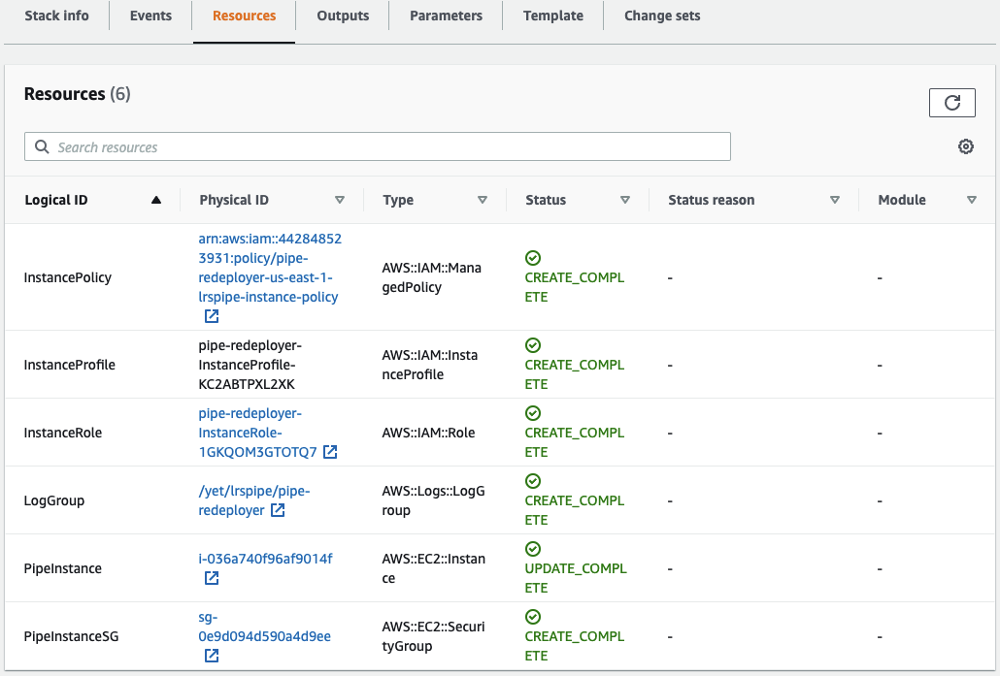

[<- Back to Index](index.md)

# Example AWS Implementation

This repo includes a sample AWS CloudFormation Template available at [`dev-resources/templates/lrspipe_ec2.yml`](https://github.com/yetanalytics/xapipe/blob/main/dev-resources/templates/lrspipe_ec2.yml). This template creates an EC2 Instance and launches an LRSPipe job on the server in Amazon Web Services. The template does not create the source or target LRS implementations and requires you to ensure that the Instance has proper access to both. In this section we will discuss how to deploy the LRSPipe template.

__NOTE:__ *This configuration is not one-size-fits-all and you may require a different configuration for your particular needs. It is provided for demonstration purposes only and can be used as a reference to adapt to your particular enterprise's needs. If you apply these templates in your own AWS account, it can and will incur charges from Amazon Web Services. Yet Analytics is in no way responsible for any charges due to applying and implementing these templates, and is in no way responsible for any outcomes of applying these templates or implementing LRSPipe. If your team is interested in consulting or support in setting up or maintaining LRS Forwarding through LRSPipe or LRS infrastructure in general please [contact Yet here](https://www.sqllrs.com/contact)*.

## Deployment

Deploying the CloudFormation Template only requires a few straightforward steps.

- Go to AWS CloudFormation Service
- Choose Create Stack (New Resources)
- Choose 'Template is Ready' / 'Upload a template file'
- Upload the Template `dev-resources/templates/lrspipe_ec2.yml`
- Click 'Next'

### Configuration

On the next page you will be presented with a number of deployment options. We will detail each one below:

- `Stack Name`: Enter a name to identify this template.
- `InstanceAmiId`: This is the operating system image of the EC2 Instance. We do not recommend changing this from default as this is the setup that has been tested with this template.
- `InstanceKeyName`: If you would like to be able to SSH to the server for diagnostic purposes, enter the SSH key-pair name for the key you would like to use for authorization. If not leave it blank.
- `InstanceSSHCidr`: Provide a whitelisted CIDR Range for access to SSH to the instance.
- `InstanceType`: This is the size of the server to create. We recommend (and have tested) a c5.large for LRSPipe jobs, but you may want to go smaller or larger depending on use-case.
- `LogRetentionInDays`: This tells CloudWatch how long to hold onto application logs. This can affect costs stemming from large amounts of log storage.
- `LrsPipeConfig`: This is where you will paste in your LRSPipe JSON job configuration. This is where all of the actual job configuration takes place. See the [JSON-based Job Config](json.md) page for details and instructions on this step.
- `LrsPipeSubnet`: This field, in conjunction with the `VPCId` determine where in your network the LRSPipe instance is created. This is important as it may impact access to the source and target LRS'. If your LRS' are hosted in the same AWS account make sure this Subnet has access to them. Alternatively if your LRS' are hosted externally, make sure this Subnet has internet access configured.
- `LrsPipeVersion`: This is the version of LRSPipe software you want to deploy. This can be used to upgrade the version on a running instance as well. For a list of LRSPipe versions visit [releases](https://github.com/yetanalytics/xapipe/releases).
- `VPCId`: This field controls which Virtual Private Cloud the Instance resides in. Make sure that the chosen VPC contains the Subnet from that previous step.

Now click 'Next' and proceed to deploy the template.

## Monitoring

This template comes with a CloudWatch configuration that allows you to view the logs directly in AWS. Once the template is deployed, in order to find the logs, go to the resources tab as pictured below and click the `LogGroup` link. This will take you to the index of logs available for viewing. *Note: Keep in mind that CloudWatch has a slight publishing delay from the time that an event occurs in the system.* These logs can be used to ensure that the LRSPipe configuration was deployed successfully, or to debug issues that may arise.

[<- Back to Index](index.md)
